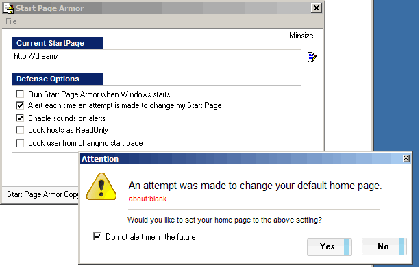



## DM Start Page Armor

### Description

DM Start Page Armor, is a small project to allow you to protect your start page in IE, one of the most common reason for ppl getting virus is by ppl changeing your start page and makeing it connect to downloaders etc, so I made this to add a little more protection, each time an attemt is made it is blocked there and then, you can enable sounds of block it without alerts, you can also lock the startpage in IE so users can edit it, and also lock your hosts file, Please vote if you like this code.
 
### More Info
 

             |
---                |---
**Submitted On**   |2006-05-19 19:48:28
**By**             |[dreamvb](https://github.com/Planet-Source-Code/PSCIndex/blob/master/ByAuthor/dreamvb.md)
**Level**          |Intermediate
**User Rating**    |5.0 (15 globes from 3 users)
**Compatibility**  |VB 5\.0, VB 6\.0
**Category**       |[Complete Applications](https://github.com/Planet-Source-Code/PSCIndex/blob/master/ByCategory/complete-applications__1-27.md)
**World**          |[Visual Basic](https://github.com/Planet-Source-Code/PSCIndex/blob/master/ByWorld/visual-basic.md)
**Archive File**   |[DM\_Start\_P200378712006\.zip](https://github.com/Planet-Source-Code/dreamvb-dm-start-page-armor__1-65836/archive/master.zip)

